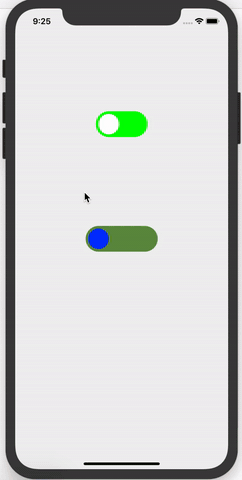

# SISwitch


Download the repository and find the SISwitch.swift file
Drag and Drop in your project

#Suitable for Swift 4 and Swift 5 version. With Xcode Above 10.




## There are two way to add the SI switch in your project

### Step 1: Storyboard

Just add the UIView in Storyboard and set its Class as SISwitch in Property inspector window also can configure colors, duration

### Step 2: Via Code

Write in viewDidLoad method
```
let customSwitch = SISwitch(frame: CGRect(x: UIScreen.main.bounds.width/2-50, y: 200, width: 100, height: 50))
  customSwitch.bgOffColor = UIColor.green
  self.view.addSubview(customSwitch)
  
```
  


